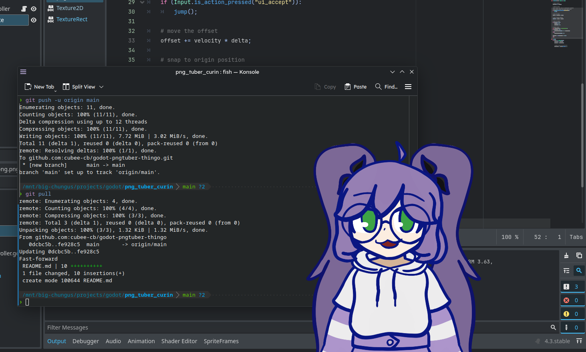

# godot pngtuber thingo

idk i wanna learn godot so yeah. the alternatives are some random tutorials i'll forget or something like the 25th version of pixel jump.

so far i got:
- Bounce animation and changing sprite triggered by pressing Space/Enter.
- Transparent window. (at least on KDE Plasma, idk what other desktops support it)
- The window is always on top.

since there's no title bar, on KDE Plasma you can move the window by holding Start/Windows key and dragging it, or whatever your OS/desktop's equivalent is. since it's always on top, i could maybe just screencapture the display with the pngtuber on top if i want without dealing with OBS triggering a prompt for every window in a scene that isn't open when i open it.
